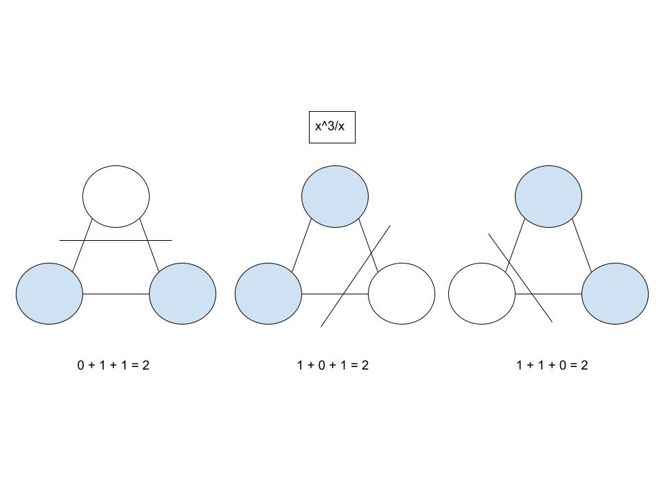
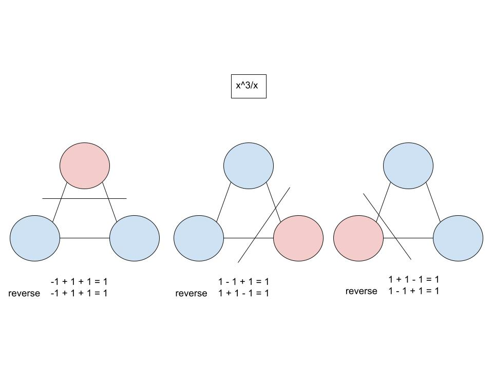

# HarmonicMonomialDeciders

### 1. x^3/x with 0 and 1

### 2. x^3/x with -1 and 1

-----

Ung, E. (2024). [Inferrable Languages](https://github.com/ericung/InferrableLanguages)
. https://github.com/ericung/InferrableLanguages

